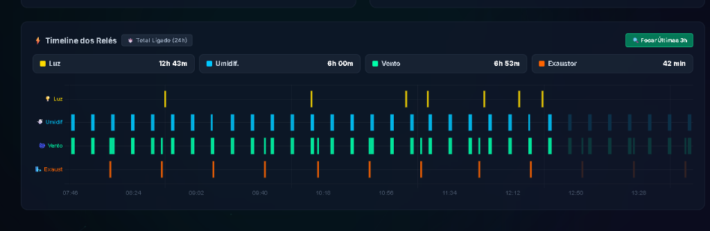
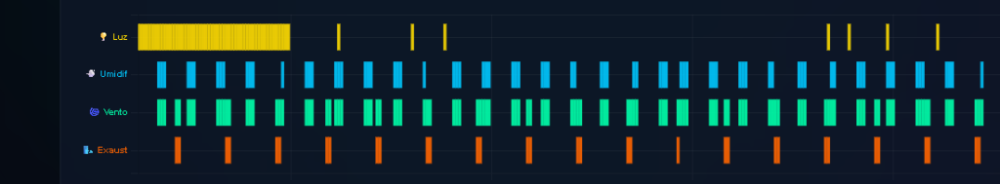

# 🍄 Grow do Txai — Sistema Inteligente de Automação IoT (v4.0 Oficial / Estável)

[](https://github.com/gabrielweb7/MyNiceGrow)
[-brightgreen?style=for-the-badge&logo=espressif)](https://www.espressif.com/)
[](https://www.arduino.cc/)
[](https://www.freertos.org/)
[](https://www.php.net/)
[](https://www.mysql.com/)
[](https://www.chartjs.org/)
[](https://github.com/)

Um ecossistema IoT autônomo, robusto e de nível profissional projetado especificamente para **micologia de precisão e controle ambiental de cultivo protegido** (especialmente fungos como *Psilocybe cubensis*, shimeji, cogumelos medicinais e comestíveis).

O sistema integra o processador **ESP32-C3 (RISC-V 32-bit)**, leitura com sensor industrial de precisão **SHT30 via I2C**, atuadores de **4 canais com optoacoplamento**, memória não-volátil anti-apagão, datalogger offline, máquina de estados não-bloqueante, atualização remota **Auto-OTA** com rollback anti-brick e um **Dashboard Web SPA em tempo real com projeção futura (Ghost Chart)**.

---

## 📸 Demonstração do Ecossistema


*Figura 1: Dashboard SPA em tempo real com telemetria, controles remotos e gráficos sincronizados de umidade, temperatura e relés.*


*Figura 2: Timeline dos 4 relés em trilhas horizontais independentes (swimlanes) e projeção preditiva (3 horas à frente).*

---

## 📑 Sumário

- [Visão Geral & Arquitetura do Sistema](#-visão-geral--arquitetura-do-sistema)
- [Diagrama de Conexões & Pinagem (Wiring & Pinout)](#-diagrama-de-conexões--pinagem-wiring--pinout)
- [Cérebro Climático & Fases de Cultivo](#-cérebro-climático--fases-de-cultivo)
- [Engenharia de Resiliência & Blindagem contra Falhas](#-engenharia-de-resiliência--blindagem-contra-falhas)
- [Dashboard Web & Projeção Futura (Ghost Chart)](#-dashboard-web--projeção-futura-ghost-chart)
- [Pipeline de Auto-Atualização Contínua (Auto-OTA)](#-pipeline-de-auto-atualização-contínua-auto-ota)
- [Estrutura de Arquivos do Repositório](#-estrutura-de-arquivos-do-repositório)
- [Guia de Compilação & Exportação](#-guia-de-compilação--exportação)
- [Diretrizes para Desenvolvedores & Futuras IAs](#-diretrizes-para-desenvolvedores--futuras-ias)

---

## 🏛️ Visão Geral & Arquitetura do Sistema

O ecossistema opera em uma **topologia híbrida e resiliente**: a placa ESP32-C3 tem **100% de autonomia local** (toma decisões a cada 2 segundos mesmo que fique sem internet por meses), enquanto a nuvem na HostGator gerencia persistência histórica, dashboard gráfico e entrega de comandos remotos.

```
┌────────────────────────────────────────────────────────────────────────┐
│                        ESP32-C3 SUPERMINI                              │
│                                                                        │
│   [ Sensor SHT30 (I2C) ] ──┐                                           │
│   [ Sensor DHT11 (GPIO10)] ┼─► [ Loop Não-Bloqueante (millis) ]        │
│   [ Botão Físico (GPIO9) ] │   [ NVS - Memória Flash Permanente ]      │
│                            │   [ LittleFS Datalogger Offline ]         │
│                            │   [ FreeRTOS Cão de Guarda (25s) ]        │
│                            │                 │                         │
│                            │                 ▼                         │
│                            │      [ Módulo 4 Relés (Active LOW) ]      │
│                            │        ├── Ch 1 (GPIO 0): Iluminação      │
│                            │        ├── Ch 2 (GPIO 1): Umidificador    │
│                            │        ├── Ch 3 (GPIO 3): Ventilador Int. │
│                            │        └── Ch 4 (GPIO 6): Exaustor Ext.   │
└────────────────────────────┼───────────────────────────────────────────┘
                             │ HTTPS / TLS (POST Telemetria a cada 10s)
                             ▼
┌────────────────────────────────────────────────────────────────────────┐
│                   NUVEM / BACKEND (HOSTGATOR CPANEL)                   │
│                                                                        │
│   [ API REST PHP 8.x ] ◄──► [ Banco MySQL (`telemetria`) ]             │
│   [ Servidor de OTA ]  ◄──► [ Binário `esp32c3.ino.bin` ]              │
└────────────────────────────┬───────────────────────────────────────────┘
                             │ JSON / Polling Dinâmico
                             ▼
┌────────────────────────────────────────────────────────────────────────┐
│                   DASHBOARD WEB (SPA RESPONSIVO)                       │
│                                                                        │
│   • Gráficos Chart.js 4.4 Sincronizados (Umidade, Temp, Timeline Relés)│
│   • Projeção Futura de 3 Horas (Ghost Bars sem barcode effect)         │
│   • Controle Remoto Imediato de Luz, Fases, Alertas e Configurações    │
│   • Horímetro de Manutenção Preventiva em Horas Reais de Operação      │
└────────────────────────────────────────────────────────────────────────┘
```

---

## 🔌 Diagrama de Conexões & Pinagem (Wiring & Pinout)

### Tabela de Pinagem Oficial (ESP32-C3 SuperMini)

| Componente | Função | Pino ESP32-C3 | Nível Lógico / Tensão | Protocolo |
| :--- | :--- | :---: | :---: | :--- |
| **SHT30 (Interno)** | Linha de Dados (SDA) | **GPIO 4** | 3.3V (Pull-up interno) | I2C (Endereço `0x44`) |
| **SHT30 (Interno)** | Linha de Clock (SCL) | **GPIO 5** | 3.3V (Pull-up interno) | I2C |
| **DHT11 (Ambiente/Sala)** | Leitura de Referência Externa | **GPIO 10** | 3.3V (Resistor 10k pull-up) | One-Wire Digital |
| **Relé 1 (Luz)** | Iluminação do Cultivo (12/12) | **GPIO 0** | Nível Baixo Ativo (`LOW`=Liga) | Digital Output |
| **Relé 2 (Umidificador)** | Névoa Ultrassônica | **GPIO 1** | Nível Baixo Ativo (`LOW`=Liga) | Digital Output |
| **Relé 3 (Ventilador)** | Circulação Interna / Brisa | **GPIO 3** | Nível Baixo Ativo (`LOW`=Liga) | Digital Output |
| **Relé 4 (Exaustor)** | Troca de Ar (FAE / Emergência) | **GPIO 6** | Nível Baixo Ativo (`LOW`=Liga) | Digital Output |
| **Botão Físico (BOOT)** | Reset de Fábrica (Segurar 5s) | **GPIO 9** | Pull-up Interno (`LOW` pressionado) | Interrupção / Polling |
| **LED RGB Integrado** | Sinalização de Status / Alertas | **GPIO 8** | WS2812 / RGB | Pulso Serial |

### Esquema Elétrico das Conexões

```
                    +-----------------------+
                    |   ESP32-C3 SuperMini  |
                    |                       |
   (3.3V) --------> | 3V3               GND | <-------- (GND Geral)
   (5V Ext) ------> | 5V                G0  | --------> IN1 (Relé Luz)
                    |                   G1  | --------> IN2 (Relé Umidificador)
   (SHT30 SDA) ---> | G4                G3  | --------> IN3 (Relé Ventilador)
   (SHT30 SCL) ---> | G5                G6  | --------> IN4 (Relé Exaustor)
   (DHT11 Data) --> | G10               G9  | <-------- Botão BOOT Integrado
                    +-----------------------+

  ALIMENTAÇÃO & PROTEÇÃO:
  • Fonte DC: 5V / 2A a 3A estabilizada com capacitor de desacoplamento de 1000uF.
  • Módulo de Relés: Alimentado em 5V com jumper VCC-JDVCC separado se disponível para isolação óptica total.
  • Relés acionados em nível lógico BAIXO (Active LOW): 
      - LOW  = Relé Atracado (Equipamento LIGADO)
      - HIGH = Relé Aberto    (Equipamento DESLIGADO)
```

---

## 🍄 Cérebro Climático & Fases de Cultivo

O algoritmo implementa perfis climáticos autônomos por fase. As configurações ficam salvas na memória permanente Flash NVS e podem ser ajustadas em tempo real pelo painel web:

| Fase | Ícone | Temp. Alvo | Umidade Alvo | Renovação de Ar (FAE) | Brisa Interna + Névoa | Objetivo Biológico |
| :--- | :---: | :---: | :---: | :---: | :---: | :--- |
| **Standby** | ⏸️ | Desligado | Desligado | Desligado | Desligado | Higienização, manutenção ou repouso entre safras. |
| **Pinagem** | 🍄 | Máx 24.0 °C | 90% a 98% | 2 min ON / 58 min OFF | 2 min ON / 8 min OFF (`vU=1`) | Estimula primórdios por alta umidade, micro-orvalho e ar rico. |
| **Frutificação**| 🌳 | Máx 25.0 °C | 88% a 95% | 2 min ON / 30 min OFF | 3 min ON / 3 min OFF (`vU=1`) | Transpiração controlada para crescimento vigoroso dos frutos. |
| **Segundo Flush**| 🔄 | Máx 24.5 °C | 90% a 96% | 2 min ON / 45 min OFF | 2 min ON / 10 min OFF (`vU=1`) | Hidratação profunda e recuperação do bolo pós-colheita. |
| **Secagem Total**| 🏜️ | Ambiente | Mínima | 100% LIGADO (Direto) | 100% LIGADO (Direto) | Umidificador travado e fluxo máximo para desidratar colheita. |

---

## 🛡️ Engenharia de Resiliência & Blindagem contra Falhas

O firmware foi desenhado com múltiplos anéis de proteção contra qualquer falha elétrica ou ambiental:

### 1. 💡 Trava Diurna Absoluta & Debounce da Luz (Anti-Picos Fantasma)
* **Debounce de 3 Ciclos:** A luz só liga se a condição noturna (`hora >= 20 || hora < 8`) permanecer confirmada por **3 ciclos consecutivos (~6 segundos)**. Glitches isolados de 1 ciclo são sumariamente descartados.
* **Trava Diurna no `aplicarReles()`:** Se o relógio indicar horário diurno (entre **08:00 e 19:59**), `releLuz` é forçado a `false` diretamente antes de tocar no pino físico.
* **Filtro Anti-Jitter:** Rejeita saltos temporais impossíveis causados por jitter em pacotes NTP de fundo.

### 2. 🌪️ Isolamento Térmico do Exaustor (Sem Sobreposição de Ciclos)
* O ciclo regular de FAE só roda quando `quente == false`.
* Ao atingir a temperatura máxima (`tempInt >= tempMax`), a placa suspende o FAE normal, zera o contador e assume a **Exaustão de Emergência** de forma exclusiva, garantindo períodos de descanso limpos.

### 3. 🚨 Proteção Anti-Queima do Umidificador (Alerta Estrito de Água)
* Se o umidificador passar **15 minutos contínuos** ligado sem atingir o alvo de umidade, a placa assume falta de água ou mangueira obstruída:
  - Desliga imediatamente o relé (`rUmid = 2`).
  - Grava na NVS para não religar em reboots acidentais.
  - Sinaliza alerta vermelho no dashboard com botão de reset manual.

### 4. 🐕 Cão de Guarda Hardware FreeRTOS (Watchdog de 25s)
* Uma tarefa FreeRTOS dedicada roda em segundo plano. Se o loop principal ficar mais de 25 segundos travado (ex: timeout de rede em biblioteca externa), a placa reinicia automaticamente de forma segura.

### 5. 📦 Datalogger Anti-Apagão (LittleFS)
* Se a internet cair, a telemetria é gravada na memória Flash local (`/offline.log`). Ao restabelecer a rede, as leituras são descarregadas em lotes seguros de 50 registros, sem perder o histórico do cultivo.

---

## 📊 Dashboard Web & Projeção Futura (Ghost Chart)

O painel é uma **SPA (Single Page Application)** ultra leve construída em Vanilla JavaScript ES6+, TailwindCSS e Chart.js 4.4:

* **Trilhas de Relés (Swimlanes):** Gráfico estilo analisador lógico onde cada relé tem sua própria faixa horizontal de 0 a 1, eliminando completamente sobreposições ou efeito código de barras.
* **Projeção Futura Predita ("Ghost Chart"):**
  - Desenha as próximas **3 horas no futuro** usando a fase real do último pulso registrado na história.
  - A iluminação projeta continuamente considerando o fuso GMT-3.
  - O umidificador projeta acoplado ao ventilador quando a regra `vU = 1` estiver ativada.
* **Centralização do Tempo Real (`AGORA 📍`):**
  - O momento presente fica posicionado exatamente no centro do gráfico (50% da largura), integrando 3 horas de histórico real à esquerda e 3 horas de projeção preditiva à direita.
  - Linha vertical tracejada com tag `AGORA 📍` demarca a fronteira entre dados medidos e previsão.
* **Motor de Renderização de Alta Performance (Zero-Lag v1.3.3):**
  - **Cache inteligente de telemetria:** Se não houver novos registros do ESP32, pula recálculos e evita re-renderizações dos canvases, mantendo a CPU em repouso.
  - **Debounce de hover (`requestAnimationFrame`):** Sincronização entre gráficos sem travamentos ou repaints repetidos.
  - **Aceleração `normalized: true`:** Chart.js não gasta ciclos ordenando dados cronológicos que já vêm ordenados.
  - **Downsampling adaptativo (7 Dias):** Agrupamento a cada 5 minutos no modo semanal (reduz de 10.080 para ~2.000 pontos) mantendo fluidez total em telas mobile.
* **Sincronia de Pan & Zoom:** Eixos X perfeitamente alinhados entre os 3 gráficos (Umidade, Temperatura e Relés), com alternância rápida entre foco centralizado e visão geral de 24 horas.
* **Controle Mão-Dupla de Iluminação & Mobile UX (v1.3.5):**
  - **Seletor Dedicado Tri-Modo:** Botões de ação rápida para `Automático (20h-08h)`, `Forçar LIGADA (ON)` e `Forçar DESLIGADA (OFF)` com autenticação por chave de Administrador.
  - **Card de Telemetria Passivo:** Card de status da Luz desacoplado de cliques acidentais (sem cursor pointer ou hover de botão), comportando-se estritamente como monitor em tempo real dos relés.
  - **Modal de Configurações Mobile-First:** Interface responsiva com rolagem suave (`max-h-[92vh]`), cabeçalho fixo, fechamento por clique no backdrop e campos de clima otimizados para smartphones.
  - **Persistência de Estado (F5-Proof):** O modo configurado é sincronizado continuamente entre ESP32, Nuvem e Dashboard (`modo_luz.txt` / NVS), garantindo que a seleção não seja perdida ao recarregar a página ou alternar de dispositivo.
  - **Comutação Imediata:** Resposta rápida em comandos manuais com bypass do dwell time automático de 15s, preservando integralmente o corte térmico biológico absoluto em 34°C.
  - **Gerenciador de Chave Admin:** Configuração visual da senha no modal do sistema com persistência local segura.
* **Horímetro de Manutenção:** Acumula os segundos reais de acionamento de cada relé gravados na Flash NVS para estimativa de desgaste da lâmpada, coolers e membrana ultrassônica.

---

## 🚀 Pipeline de Auto-Atualização Contínua (Auto-OTA)

A atualização do firmware é **100% remota e autônoma**:

```
[ Arduino IDE ] ──(Ctrl + Alt + S)──► build/.../esp32c3.ino.bin
                                               │
                                       [ Git Commit & Push ]
                                               │
                                               ▼
                                      [ Repositório GitHub ]
                                               │
                                       [ SSH / Git Pull ]
                                               │
                                               ▼
                                  [ Servidor HostGator cPanel ]
                                               │
               ESP32 detecta nova versão (filemtime > fwAtual)
                                               │
                                               ▼
                     [ ESP32 baixa binário via HTTPS e reinicia ]
                                               │
                             ┌─────────────────┴─────────────────┐
                             ▼                                   ▼
                      [ Boot OK ]                         [ Falha / Bootloop ]
               Grava versão e roda estável            Rollback automático (Anti-Brick)
```

1. Na IDE do Arduino, pressione `Ctrl + Alt + S` para exportar o binário compilado.
2. Faça o `git commit` e `git push` do repositório (incluindo a pasta `build/`).
3. Dê o `git pull` no servidor de produção HostGator.
4. O ESP32, ao enviar telemetria (a cada 10s), recebe o timestamp do novo `.bin`. Se for mais novo que a versão da placa, **ele baixa o arquivo sozinho e se atualiza sem nenhuma intervenção manual!**

---

## 🗂️ Estrutura de Arquivos do Repositório

```text
├── esp32c3.ino                                    # Código-fonte oficial do Firmware C++ (ESP32-C3)
├── build/esp32.esp32.esp32c3/                     # Diretório de binários compilados pelo Arduino
│   └── esp32c3.ino.bin                            # Binário de produção servido para atualizações OTA
├── docs/img/                                      # Screenshots e diagramas do ecossistema
│   ├── dashboard_preview.png                      # Visão do painel web SPA em tempo real
│   └── timeline_relays.png                        # Swimlanes dos relés e projeção preditiva
├── grow.alquimistasmagicos.com.br/                # Código do Dashboard Web e Backend REST
│   ├── index.html                                 # Dashboard SPA (TailwindCSS, Chart.js 4.4, Canvas)
│   ├── config.php                                 # Chaves de segurança e credenciais do MySQL
│   ├── database.sql                               # Script de inicialização da tabela `telemetria`
│   └── api/                                       # Endpoints REST em PHP 8.x
│       ├── index.php                              # Telemetria (POST ESP32 / GET Dashboard) & Purge
│       ├── comando.php                            # Fila de comandos pendentes (Fases, Luz, Reset)
│       └── fw.php                                 # Sincronização de versões e hash do Git
└── README.md                                      # Documentação mestra do ecossistema
```

---

## 🛠️ Guia de Compilação & Exportação

### Configurações na Arduino IDE:
1. Adicione a URL de placas Espressif em **Preferências**:
   `https://raw.githubusercontent.com/espressif/arduino-esp32/gh-pages/package_esp32_index.json`
2. Selecione a placa: **`ESP32C3 Dev Module`**
3. **Partition Scheme:** `Minimal SPIFFS (1.9MB APP with OTA/128KB SPIFFS)` *(Obrigatório para suportar OTA)*
4. **Flash Size:** `4MB (32Mb)`
5. **USB CDC On Boot:** `Enabled`
6. **Upload Speed:** `921600`

### Como Atualizar o Binário:
* No Windows, com o sketch `esp32c3.ino` aberto: pressione **`Ctrl + Alt + S`** (*Sketch -> Export Compiled Binary*).
* O Arduino compila e gera o arquivo `build/esp32.esp32.esp32c3/esp32c3.ino.bin`.

---

## 🤖 Diretrizes para Desenvolvedores & Futuras IAs

1. **Janela Deslizante de 24h:** O gráfico não usa dias de calendário (00:00 às 23:59). Ele usa uma janela contínua das últimas 24 horas a partir do momento atual (`ORDER BY id DESC LIMIT 1440`). Preserve este comportamento.
2. **Preservar a Autonomia Local:** O ESP32 deve sempre ser capaz de operar de forma autônoma sem internet. Nunca crie dependências onde a falta de resposta da nuvem trave o controle térmico ou os relés.
3. **Segurança Biológica Inviolável:**
   - Nunca remova o desarme do umidificador aos 15 minutos sem resposta (`rUmid = 2`).
   - Nunca remova o corte térmico de emergência da lâmpada aos 34 °C.
   - Mantenha o isolamento do exaustor de emergência para não sobrepor o FAE normal.
4. **Sincronia das Camadas:** Ao alterar nomes de chaves na telemetria JSON (`tI`, `uI`, `rLuz`, etc.), atualize de forma sincronizada em `esp32c3.ino`, `api/index.php` e `index.html`.

---

## 🧙‍♂️ Créditos & Licença

Desenvolvido com carinho para o **Grow do Txai** por **Alquimistas Mágicos**.  
Distribuído sob licença **MIT**. Sinta-se livre para usar, estudar e evoluir a automação micológica! 🍄✨
